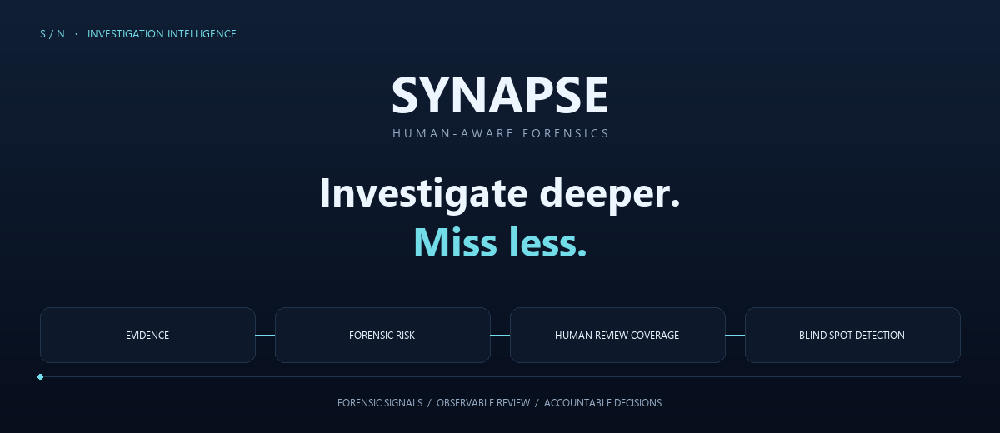
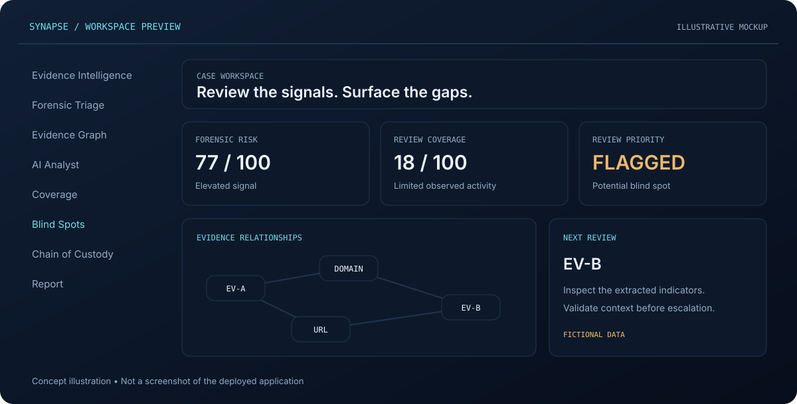
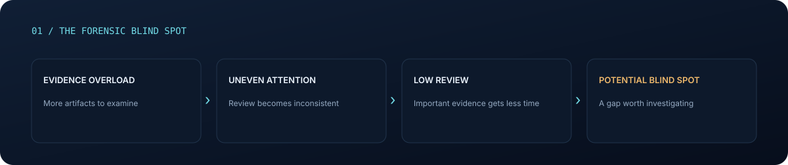
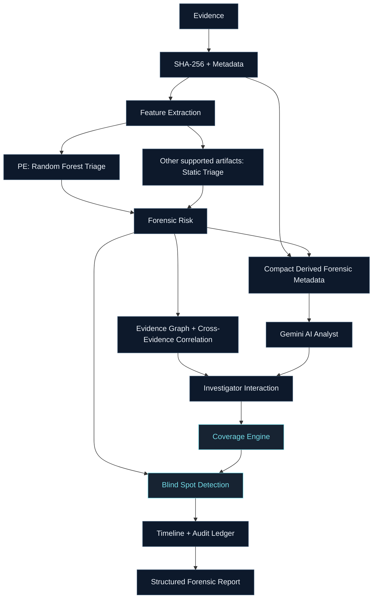
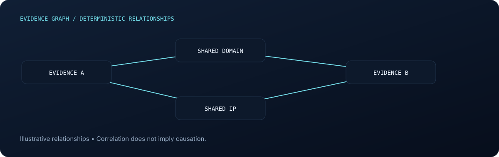
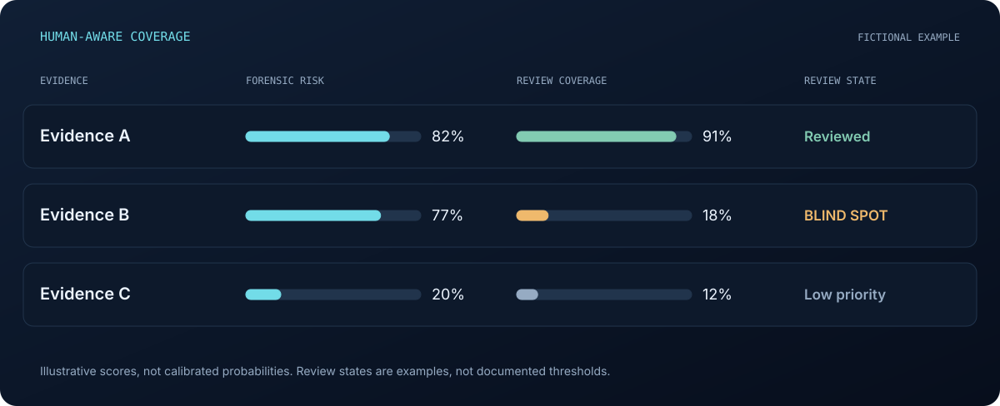
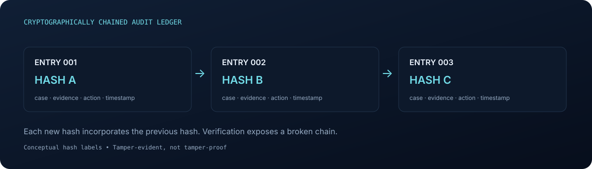
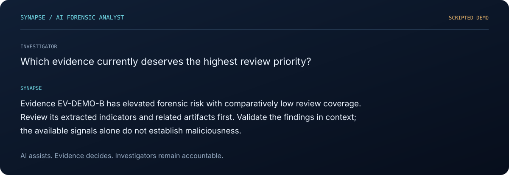
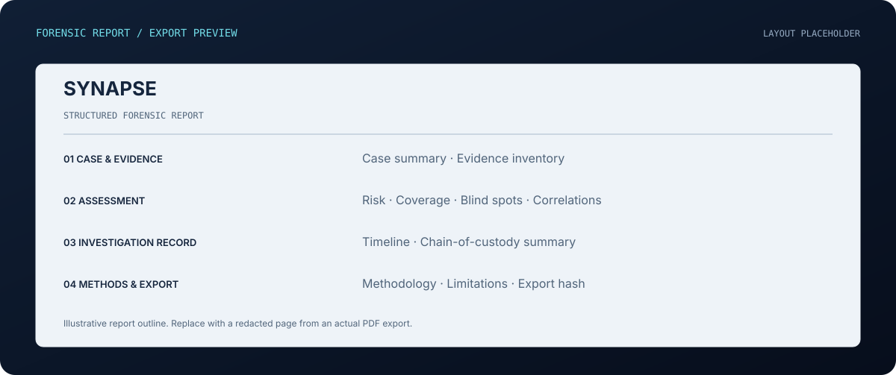

<div align="center">



**Human-Aware AI Cyber-Forensic Investigation System**

[](https://synapse-smoky-eta.vercel.app)
[](https://synapse-3c6o.onrender.com/docs)
[](https://github.com/Zeenat-25/SYNAPSE)

[Static hero](assets/readme/hero.svg) · [How it works](#investigation-workflow) · [Local setup](#local-setup) · [Limitations](#limitations)

</div>

## Evidence intelligence. With review accountability.

Digital forensic investigations create evidence overload. An important artifact can be available, indexed and analyzed—and still receive insufficient human review. SYNAPSE combines AI- and ML-assisted evidence analysis with observable investigation coverage to help investigators prioritize their next step.

**SYNAPSE does not only ask what the evidence contains. It asks whether the evidence that mattered was actually investigated.** Coverage provides interaction-based signals toward that question; it cannot establish understanding.

## Product preview



<sub>Design illustration, not a screenshot of the deployed application. Replace with a redacted dashboard capture using the [asset guide](assets/readme/ASSETS.md).</sub>

## The forensic blind spot



## The SYNAPSE idea


**Evidence Coverage Assurance** connects the artifact’s forensic signals with the investigation activity it received. The formula is a conceptual prioritization heuristic, not a documented scoring equation or proof of maliciousness or investigator error.

## Investigation capabilities

| | |
| :--- | :--- |
| **Evidence Intelligence**<br>Register and store evidence; extract metadata and verify SHA-256 integrity. | **Forensic Triage**<br>Prioritize forensic signals through PE model output and deterministic static artifact analysis. |
| **PE Machine Learning**<br>Random Forest triage for PE files, with feature importance to support interpretation. | **Evidence Graph**<br>Explore deterministic cross-evidence relationships and shared indicators. |
| **AI Analyst**<br>Ask investigation questions and obtain metadata-grounded summaries and review recommendations. | **Investigation Coverage**<br>Summarize observable review activity, including focused duration, views, revisits and actions. |
| **Blind Spot Detection**<br>Surface evidence with elevated forensic risk and comparatively low review coverage. | **Timeline**<br>Follow investigation activity within the case workflow. |
| **Chain of Custody**<br>Record evidence actions in a cryptographically chained tamper-evident audit ledger. | **Forensic Reporting**<br>Export structured findings, investigation context and limitations as PDF reports. |

## Investigation workflow


<details>
<summary><strong>Architecture · from evidence to accountable reporting</strong></summary>



Conceptual data flow, not an endpoint map. Timeline and custody records also capture actions throughout the investigation; they are not deferred until blind spot analysis.

</details>

**Uploaded evidence is analyzed statically. SYNAPSE never executes uploaded evidence.**

## Forensic risk vs. review priority

| Signal | What it represents | How to use it |
| :--- | :--- | :--- |
| **Forensic risk** | How suspicious or relevant an artifact appears from available forensic signals. | Decide which indicators need validation. |
| **Coverage** | How much observable investigation activity an artifact received. | Identify evidence with limited recorded review. |
| **Blind spot priority** | An artifact’s potential importance relative to how little it has been reviewed. | Choose what to revisit or examine next. |

Risk scores from different analyzers are **not uniformly calibrated probabilities**. High coverage does not establish safety, and low coverage alone does not establish importance.

## Machine learning

The PE pipeline uses a **Random Forest** for executable triage. The project reports an **F1 score of 0.9962 on its held-out PE evaluation dataset**.

| Evaluation detail | Project-reported value |
| :--- | :--- |
| Dataset size | Approximately 138,047 PE samples |
| Features | 40 |
| Class distribution | Approximately 41,323 benign / 96,724 malicious |
| Model | Random Forest |
| Holdout F1 | 0.9962 |
| Model output | PE triage support |

These are dataset-specific evaluation results. Real-world performance may differ, and performance on the held-out dataset does not guarantee results on future samples. Feature importance helps interpret the model’s reliance on inputs; it does not prove why an artifact is malicious.

**Non-PE artifacts follow a different path.** PDF, TXT, PNG and other supported artifacts use deterministic static analysis and heuristics. PDF JavaScript, entropy, URLs, IP addresses, PowerShell references and suspicious strings are indicators to investigate—not definitive malware proof.

## Evidence graph



Deterministic relationships help investigators follow connections across evidence. Relationship sources can include shared IP addresses, URLs, domains, filenames, artifact indicators and case context. Inspect the underlying artifacts and context before drawing conclusions.

**Correlation does not imply causation.**

## Human-aware coverage



<sub>Fictional demonstration values. Percentages illustrate score displays, not probabilities; review labels do not specify production thresholds.</sub>

Coverage uses **focused duration, views, revisits, visible-tab time and investigation actions**. It measures observable interaction—not eye tracking, mind reading or comprehension. A “reviewed” state describes recorded activity, not a verified conclusion about the evidence.

## Chain of custody



SYNAPSE uses a **cryptographically chained tamper-evident audit ledger**. Each new SHA-256 hash links the previous hash with the case, evidence, action and timestamp.

Changing a prior record breaks verification against the existing downstream chain. This provides tamper evidence, not tamper-proof storage; trust also depends on protecting the ledger and its verification reference. Evidence SHA-256 verification checks file integrity, while ledger chaining checks recorded history.

## AI analyst



Gemini receives **compact derived forensic metadata**, rather than blindly receiving raw evidence. It assists with case summaries, evidence prioritization, relationship explanations, review recommendations, investigation questions and uncertainty-aware reasoning. Derived metadata can still be sensitive; account for it when configuring external AI access.

**AI assists. Evidence decides. Investigators remain accountable.** Recommendations require investigator validation. SYNAPSE does not determine guilt, intent, truth, criminal responsibility or investigator comprehension.

## Reporting



Structured PDF reporting brings together:

- **Case and evidence:** case summary and evidence inventory.
- **Assessment:** forensic risk, coverage, blind spots and correlations.
- **Investigation record:** timeline and chain-of-custody summary.
- **Methods and export:** methodology, limitations and export hash.

<sub>Replace the layout placeholder with a redacted page from an actual SYNAPSE report. An export hash supports integrity checking; it does not validate the report’s conclusions.</sub>

## Tech stack

| Layer | Technologies |
| :--- | :--- |
| Frontend | **Next.js · React · TypeScript** |
| Backend & persistence | **Python · FastAPI · SQLModel · SQLite** |
| PE machine learning & parsing | **scikit-learn · Random Forest · joblib · pandas · pefile** |
| AI assistance | **Google Gemini API · google-genai** |
| PDF reporting | **ReportLab** |
| Deployment & source | **Vercel · Render · GitHub** |

## Project structure

```text
SYNAPSE/
├── backend/
│   ├── app/
│   ├── ml/
│   └── requirements.txt
├── frontend/
│   ├── app/
│   ├── components/
│   ├── lib/
│   └── public/
├── assets/
│   └── readme/              # README visuals and replacement guide
└── README.md
```

## Local setup

Install Python, Node.js with npm, and Git. Use the versions required by the repository’s dependency manifests.

### 1. Get the source

```powershell
git clone https://github.com/Zeenat-25/SYNAPSE.git
cd SYNAPSE
```

### 2. Configure the AI assistant

Create `backend/.env` locally:

```dotenv
GEMINI_API_KEY=
GEMINI_MODEL=
```

Set your own Gemini API key and an available model identifier supported by your configuration. Keep `.env` and credentials out of version control.

### 3. Start the backend

From the repository root, in PowerShell:

```powershell
cd backend
python -m venv .venv
.\.venv\Scripts\Activate.ps1
python -m pip install -r requirements.txt
python -m fastapi dev app/main.py
```

If PowerShell blocks activation, use the environment’s interpreter directly:

```powershell
.\.venv\Scripts\python.exe -m pip install -r requirements.txt
.\.venv\Scripts\python.exe -m fastapi dev app/main.py
```

### 4. Start the frontend

In a second terminal, from the repository root:

```powershell
cd frontend
npm install
npm run dev
```

Open the local URL printed by Next.js. Use the backend URL printed by FastAPI for local API access. Check the frontend’s API configuration points to that local backend before testing; use any environment example provided by the repository.

## Live deployment

| Service | Address |
| :--- | :--- |
| Frontend | [Open SYNAPSE](https://synapse-smoky-eta.vercel.app) |
| Backend | [Backend service](https://synapse-3c6o.onrender.com) |
| API documentation | [Interactive API docs](https://synapse-3c6o.onrender.com/docs) |

The public deployment is intended for demonstration. **Do not upload confidential real-world forensic evidence without appropriate production security and storage controls.** Free hosting storage may be ephemeral; deployment availability and persistence depend on the hosting configuration.

## Limitations

- **Expert judgment remains essential.** SYNAPSE supports forensic experts; it does not replace them. Risk does not equal guilt or establish intent, truth or criminal responsibility.
- **Indicators require context.** Static findings are not definitive malware proof, and correlations do not prove causation.
- **Coverage measures interaction.** Recorded activity does not establish comprehension, complete review or investigator error.
- **ML results are dataset-specific.** Holdout metrics are not guarantees for future evidence; scores across analyzers are not uniformly calibrated probabilities.
- **AI recommendations require validation.** Metadata may be incomplete, and generated interpretations may be incorrect.
- **Deployment controls matter.** Sensitive evidence requires appropriate access controls, case isolation and durable storage. Public demos and ephemeral hosting are unsuitable for confidential casework.

## Roadmap

Future directions; these are not claims of shipped functionality.

- [ ] Persistent production evidence storage
- [ ] Authentication and role-based access control (RBAC)
- [ ] Organization-level case isolation
- [ ] Additional artifact parsers
- [ ] Advanced forensic search
- [ ] Case comparison
- [ ] Optional BrainFlow EEG research module, subject to consent and validation; no comprehension claims
- [ ] Improved evidence relationship models

---

<div align="center">

**Designed & engineered by Zeenat Ansari**

[GitHub](https://github.com/Zeenat-25) · [LinkedIn](https://www.linkedin.com/in/zeenat-ansari-ab566b353/) · [Email](mailto:libraskingdom@gmail.com)


</div>
