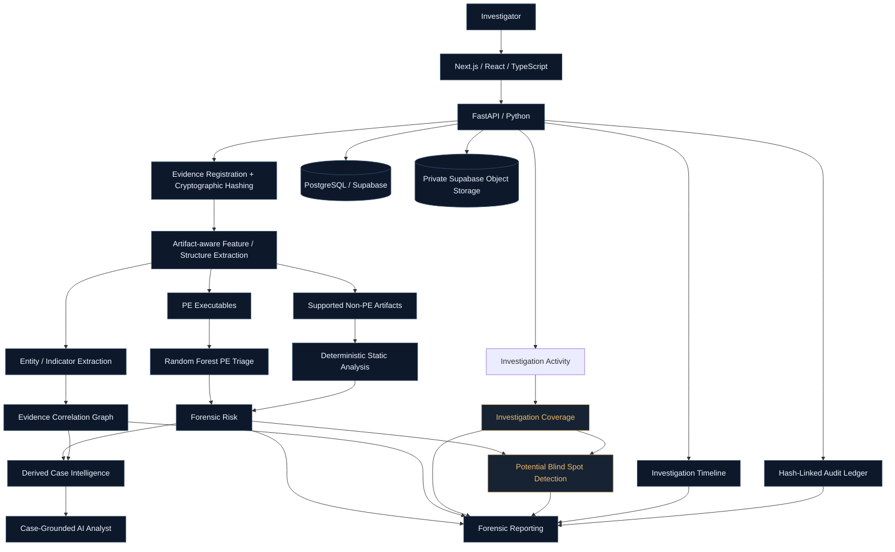

<div align="center">


**Human-Aware Cyber-Forensic Investigation Platform**

[](https://synapse-smoky-eta.vercel.app)
[](https://synapse-smoky-eta.vercel.app/cases/1)
[](https://synapse-3c6o.onrender.com/docs)
[](https://github.com/Zeenat-25/SYNAPSE)

[Static hero](assets/readme/hero.svg) · [How it works](#investigation-workflow) · [60-second demo](#-60-second-judge-demo) · [Architecture](#architecture) · [Local setup](#local-setup) · [Limitations](#limitations)

</div>

---

## Evidence intelligence. With investigation awareness.

Digital forensic investigations can contain hundreds of heterogeneous artifacts.

Emails. Financial records. Audit trails. PDFs. Executables. Network logs. Server activity.

The problem is not simply finding evidence.

An important artifact can already be available, indexed and analyzed — and still receive insufficient investigative attention as a case grows.

SYNAPSE combines **evidence intelligence** with **investigation intelligence** to help investigators understand what evidence contains, how it connects to the wider case, and whether potentially important evidence may be receiving too little review attention.

**SYNAPSE does not only ask what the evidence contains. It also asks whether important evidence was investigated thoroughly enough to deserve confidence.**

Coverage provides observable interaction signals toward that question. It cannot establish human understanding or comprehension.

Built for **digital forensic investigators, cybercrime teams, security analysts and incident-response teams** working with complex, multi-artifact investigations.

---

## Product preview


<sub>
The graphic above is a design overview of the SYNAPSE investigation workspace.  
The working application can be inspected directly through the
<a href="https://synapse-smoky-eta.vercel.app">live platform</a>
or the
<a href="https://synapse-smoky-eta.vercel.app/cases/1">demo investigation</a>.
</sub>

---

## ⚡ 60-second judge demo

If you are reviewing SYNAPSE, this is the fastest way to understand the project:

1. [Open the demo investigation](https://synapse-smoky-eta.vercel.app/cases/1)
2. Open **Forensic Triage** and inspect artifact-aware analysis
3. Open **Evidence Graph** and follow cross-artifact relationships
4. Open **Coverage** and inspect recorded investigation attention
5. Open **Blind Spots** and compare forensic significance with review coverage
6. Open **Timeline**
7. Open **Chain of Custody**
8. Open **Report** and generate the forensic PDF

> **The evidence was collected.  
> The risk was detected.  
> The investigator even saw it.  
> And it could still be missed.**

That gap between **forensic significance** and **investigation coverage** is the central idea behind Human-Aware Forensics.

---

## The forensic blind spot


Complex investigations create an attention problem.

Even when evidence has already been discovered, investigators still have to decide:

- What does this artifact mean?
- What is it connected to?
- What deserves attention first?
- What evidence has already received enough review?
- What evidence may still deserve another look?

SYNAPSE is designed to help surface the last question.

---

## The SYNAPSE idea


**Investigation Coverage** connects an artifact's forensic significance with the observable investigation activity it received.

Combined with forensic risk, this helps SYNAPSE surface **potential investigative blind spots** for human review.

The relationship is a decision-support heuristic.

It is **not** proof of:

- maliciousness
- guilt
- investigator error
- investigator comprehension
- legal significance

The investigator remains responsible for interpretation and decision-making.

---

## Investigation capabilities

| | |
| :--- | :--- |
| **Evidence Intelligence**<br>Register and store evidence, extract metadata and verify evidence integrity through cryptographic hashes. | **Forensic Triage**<br>Prioritize forensic signals using PE model output and deterministic static artifact analysis. |
| **Artifact-Aware Analysis**<br>Interpret supported evidence according to its forensic structure rather than treating every file as generic content. | **PE Machine Learning**<br>Random Forest triage for Windows PE files with static feature extraction. |
| **Evidence Graph**<br>Explore cross-evidence relationships, shared entities and forensic indicators. | **AI Analyst**<br>Ask investigation questions and obtain case-grounded summaries, priorities and review recommendations. |
| **Investigation Coverage**<br>Summarize observable review activity including focused duration, views, revisits, analysis and integrity verification. | **Blind Spot Detection**<br>Surface potential investigative blind spots where forensic significance and investigation coverage appear meaningfully misaligned. |
| **Timeline**<br>Reconstruct investigation activity across the case workflow. | **Chain of Custody**<br>Record important evidence and investigation actions in a cryptographically chained tamper-evident ledger. |
| **Forensic Reporting**<br>Export evidence findings, investigation context, coverage, blind spots, timeline and custody information as a structured PDF report. | **Persistent Case Architecture**<br>Store investigation data through PostgreSQL and evidence objects through private Supabase storage. |

---

## Investigation workflow


Evidence integrity, timeline and audit activity accumulate throughout the investigation rather than existing only at the end of the workflow.

---

<details>

<summary><strong>Architecture · from evidence to accountable reporting</strong></summary>



This is a conceptual architectural view rather than an endpoint map.

Local development can use SQLite and local filesystem storage as fallbacks. Production deployment supports PostgreSQL-backed persistence and private Supabase object storage.

</details>

---

## Static-first forensic analysis

**Uploaded suspicious evidence is analyzed statically. SYNAPSE does not need to execute uploaded evidence for its PE triage workflow.**

This reduces the need to run unknown binaries merely to classify them.

Supported artifacts can follow different analysis strategies depending on their structure.

```text
EMAIL
  ↓
participants · timestamps · subjects · messages · entities

FINANCIAL LEDGER
  ↓
transactions · accounts · amounts · financial records

AUDIT LOG
  ↓
administrative events · account activity · timestamps

NETWORK / SERVER LOG
  ↓
network activity · addresses · domains · events

PE EXECUTABLE
  ↓
static PE features · Random Forest triage

GENERIC EVIDENCE
  ↓
metadata · static indicators · heuristic analysis
```

> **Same investigation. Different evidence. Different forensic reasoning.**

Deterministic extraction is used wherever practical so that the evidence remains the primary source of truth.

---

## Forensic risk vs. investigation coverage

| Signal | What it represents | How to use it |
| :--- | :--- | :--- |
| **Forensic risk** | How suspicious or potentially significant an artifact appears based on available forensic signals. | Decide which findings require contextual validation. |
| **Investigation coverage** | How much observable investigation activity an artifact received. | Identify evidence with comparatively limited recorded review. |
| **Blind spot priority** | A potential mismatch between forensic significance and investigation attention. | Decide what evidence may deserve another human review. |

Risk scores produced by different analyzers are **not uniformly calibrated probabilities**.

High coverage does not establish that evidence is safe or fully understood.

Low coverage alone does not establish importance.

---

## Machine learning

The Windows PE pipeline uses a **Random Forest** classifier for executable triage.

The project reports an **F1 score of 0.9962 on its held-out PE evaluation set**.

| Evaluation detail | Project-reported value |
| :--- | :--- |
| Dataset size | **138,047 rows** |
| Features | **40** |
| Class distribution | **41,323 benign / 96,724 malicious** |
| Selected model | **Random Forest** |
| Held-out F1 | **0.9962** |
| Analysis type | **Static PE analysis** |
| Model role | **Triage / forensic risk support** |

Pipeline:

```text
PE FILE
   ↓
STATIC FEATURE EXTRACTION
   ↓
40 FEATURES
   ↓
RANDOM FOREST
   ↓
TRIAGE / FORENSIC RISK SUPPORT
```

These results are specific to the evaluation dataset.

Real-world performance may differ, and held-out performance does not guarantee future behavior on unseen operational evidence.

Feature importance can help inspect model reliance on input features. It does not prove why a specific file is malicious.

### Non-PE evidence

Non-PE artifacts follow a different analysis path.

Supported text, PDF, image and structured-artifact workflows use deterministic extraction, static indicators and heuristics rather than being presented as Random Forest predictions.

Indicators such as:

- URLs
- IP addresses
- suspicious strings
- PowerShell references
- document structure
- embedded tokens
- entropy

are signals requiring investigation.

Their presence alone does not prove maliciousness.

---

## Evidence graph


Digital investigations are rarely solved one file at a time.

SYNAPSE extracts forensic entities and indicators and connects evidence through deterministic relationships.

Relationship sources can include:

- shared IP addresses
- URLs
- domains
- email addresses
- filenames
- hashes
- artifact indicators
- case context

An entity appearing once may simply be data.

The same entity appearing across multiple independent artifacts may become a **lead worth examining**.

```text
EMAIL ─────────────┐
                   │
LEDGER ───── ACCOUNT / ENTITY ───── AUDIT
                   │
NETWORK LOG ───────┘
```

**Correlation does not imply causation.**

Investigators must inspect the underlying evidence and context before drawing conclusions.

> Explore the working implementation in the [live demo](https://synapse-smoky-eta.vercel.app/cases/1).

---

## Human-aware coverage


<sub>
Fictional demonstration values. Percentages illustrate score displays rather than probabilities.
</sub>

Investigation Coverage uses observable interaction signals such as:

- focused review duration
- views
- revisits
- analysis activity
- integrity verification
- investigation actions

Coverage measures **observable interaction with evidence**.

It does not measure:

- eye movement
- gaze
- brain activity
- mental state
- comprehension
- investigator competence

A recorded review state describes activity captured by SYNAPSE.

It does not certify that a human fully understood an artifact.

---

## Potential investigative blind spots

This is the central Human-Aware Forensics concept.

```text
HIGH FORENSIC SIGNIFICANCE
             +
LOW INVESTIGATION COVERAGE
             ↓
POTENTIAL INVESTIGATIVE BLIND SPOT
```

The objective is not to accuse an investigator of missing evidence.

The objective is to surface a mismatch worth reviewing.

> **The evidence was collected.  
> The risk was detected.  
> The investigator even saw it.  
> And it could still be missed.**

SYNAPSE therefore goes beyond asking:

> **What looks suspicious?**

It can also support the question:

> **If this evidence appears important, why is it receiving comparatively little investigative attention?**

Blind spots are prioritization signals for **human review**, not automated conclusions.

---

## Chain of custody


SYNAPSE uses a **cryptographically chained tamper-evident audit ledger** for important investigation events.

Each ledger entry can incorporate information such as:

```text
previous hash
+
case
+
evidence
+
action
+
timestamp
↓
new cryptographic hash
```

Changing an earlier record causes verification against the existing downstream chain to fail.

This provides **tamper evidence**, not tamper-proof storage.

Trust still depends on protecting:

- the ledger
- its database
- server infrastructure
- verification references
- access controls

Evidence-file hash verification and audit-ledger verification serve different purposes:

**Evidence hashes** help verify file integrity.

**Ledger chaining** helps verify investigation-history continuity.

SYNAPSE does not claim that either mechanism alone establishes legal admissibility.

---

## Investigation timeline

SYNAPSE records investigation activity so the investigator can reconstruct not only what appears inside evidence, but also how the investigation itself unfolded.

Timeline events can include:

```text
EVIDENCE REGISTRATION
        ↓
INTEGRITY VERIFICATION
        ↓
FORENSIC ANALYSIS
        ↓
REVIEW ACTIVITY
        ↓
CORRELATION
        ↓
INVESTIGATION ACTIONS
        ↓
REPORTING
```

This helps preserve investigation context as the case grows.

---

## AI analyst


The AI analyst is an **investigation-assistance layer**, not the core forensic engine.

Gemini receives compact derived case and forensic metadata to assist with:

- case summaries
- evidence prioritization
- relationship explanations
- investigation questions
- review recommendations
- uncertainty-aware reasoning

The central forensic workflow remains grounded in:

- evidence metadata
- deterministic parsing
- static analysis
- PE model output
- relationship correlation
- investigation coverage
- audit history

Derived metadata can still contain sensitive information and must be handled appropriately when external AI services are configured.

> **AI assists. Evidence remains evidence. Investigators decide.**

The AI analyst does not determine:

- guilt
- intent
- truth
- criminal responsibility
- investigator competence
- comprehension

AI-generated recommendations require investigator validation.

---

## Reporting


SYNAPSE generates structured forensic PDF reports using **Python + ReportLab**.

Reports can bring together:

### Case and evidence
- case information
- evidence inventory
- cryptographic integrity information

### Forensic assessment
- artifact-specific findings
- forensic risk
- evidence relationships
- correlation intelligence

### Investigation intelligence
- investigation coverage
- potential blind spots
- review context

### Investigation record
- timeline activity
- chain-of-custody summary
- audit verification

### Methodology and limitations
- analysis methods
- forensic limitations
- model disclaimers
- investigation caveats

An investigation should not end with a dashboard.

SYNAPSE is designed to carry the workflow from:

```text
EVIDENCE INTAKE
      ↓
VERIFICATION
      ↓
ANALYSIS
      ↓
CORRELATION
      ↓
INVESTIGATION REVIEW
      ↓
BLIND-SPOT AWARENESS
      ↓
TIMELINE + CUSTODY
      ↓
FORENSIC REPORT
```

An export hash can support file-integrity verification.

It does not validate the correctness of the report's conclusions.

---

## Tech stack

| Layer | Technologies |
| :--- | :--- |
| Frontend | **Next.js · React · TypeScript · Vercel** |
| Backend | **Python · FastAPI · SQLModel · Render** |
| Production database | **PostgreSQL · Supabase** |
| Evidence storage | **Private Supabase Object Storage** |
| Local development fallback | **SQLite · Local filesystem** |
| PE machine learning | **scikit-learn · Random Forest · joblib · pandas · pefile** |
| Forensic processing | **Deterministic parsers · Static analysis · Evidence correlation** |
| AI assistance | **Google Gemini API · google-genai** |
| Integrity | **SHA-256 · SHA-1 · MD5 · Hash-linked audit ledger** |
| PDF reporting | **ReportLab** |
| Source control | **GitHub** |

---

## Scalability & extensibility

SYNAPSE is designed around a **modular artifact-analysis pipeline** rather than a single hard-coded evidence format.

```text
NEW ARTIFACT TYPE
        ↓
SPECIALIZED PARSER
        ↓
COMMON STRUCTURED EVIDENCE MODEL
        ↓
EXISTING INVESTIGATION WORKFLOW
```

That means a new supported artifact can enter the same broader investigation pipeline:

```text
INGEST
  ↓
EXTRACT
  ↓
TRIAGE
  ↓
CORRELATE
  ↓
REVIEW
  ↓
COVERAGE
  ↓
BLIND SPOTS
  ↓
TIMELINE
  ↓
REPORT
```

Current artifact-oriented processing includes support for concepts such as:

- email evidence
- financial ledgers
- audit records
- network/server logs
- PE executables
- generic evidence

Persistent case data is stored using **PostgreSQL / Supabase**, while evidence files can be stored using **private Supabase Object Storage**.

The FastAPI backend separates forensic processing from the Next.js interface.

This provides **architectural extensibility**.

It is not a claim that enterprise-scale throughput has already been proven through production load testing.

---

## Real-world purpose

The goal of SYNAPSE is not to generate more alerts.

It is to help preserve **investigative awareness** as a case becomes more complex.

SYNAPSE is designed to help investigators:

```text
UNDERSTAND
    ↓
CONNECT
    ↓
PRIORITIZE
    ↓
REVIEW
    ↓
NOTICE GAPS
    ↓
RECONSTRUCT
    ↓
REPORT
```

Potential benefits include:

- bringing heterogeneous evidence into one investigation context
- connecting forensic entities across artifacts
- prioritizing evidence for further review
- preserving integrity and investigation history
- highlighting evidence receiving comparatively limited attention
- reducing the possibility that significant evidence remains under-reviewed
- creating a more reconstructable investigation record

These are intended benefits of the design.

SYNAPSE does not claim measured reductions in investigative errors without field validation.

---

## Project structure

```text
SYNAPSE/
├── backend/
│   ├── app/
│   │   ├── routers/
│   │   ├── forensic engines
│   │   ├── correlation
│   │   ├── coverage
│   │   ├── blind spots
│   │   ├── timeline / audit
│   │   └── reporting
│   │
│   ├── ml/
│   │   └── trained PE model
│   │
│   └── requirements.txt
│
├── frontend/
│   ├── app/
│   ├── components/
│   ├── lib/
│   └── public/
│
├── assets/
│   └── readme/
│       ├── hero.gif
│       ├── hero.svg
│       ├── blindspot-demo.svg
│       ├── synapse-flow.svg
│       ├── evidence-graph.svg
│       ├── coverage-demo.svg
│       ├── audit-chain.svg
│       ├── analyst-demo.svg
│       └── README visuals
│
└── README.md
```

---

## Live deployment

| Service | Address |
| :--- | :--- |
| Frontend | [Open SYNAPSE](https://synapse-smoky-eta.vercel.app) |
| Demo investigation | [Open Case](https://synapse-smoky-eta.vercel.app/cases/1) |
| Backend | [Backend service](https://synapse-3c6o.onrender.com) |
| API documentation | [Interactive API docs](https://synapse-3c6o.onrender.com/docs) |
| Source | [GitHub Repository](https://github.com/Zeenat-25/SYNAPSE) |

The public deployment is intended for demonstration.

Production case data can be persisted through PostgreSQL / Supabase, while uploaded evidence can be stored in private Supabase object storage.

Frontend and backend compute availability can still depend on their hosting platforms, including possible cold-start behavior.

**Do not upload confidential real-world forensic evidence to the public demonstration environment without appropriate production authentication, authorization and evidence-governance controls.**

---

## Local setup

### 1. Clone the repository

```bash
git clone https://github.com/Zeenat-25/SYNAPSE.git
cd SYNAPSE
```

---

### 2. Backend

```bash
cd backend
python -m venv .venv
```

Activate the virtual environment.

#### Windows

```bash
.venv\Scripts\activate
```

Install backend dependencies:

```bash
pip install -r requirements.txt
```

Run FastAPI:

```bash
uvicorn app.main:app --reload
```

Backend:

```text
http://127.0.0.1:8000
```

API documentation:

```text
http://127.0.0.1:8000/docs
```

Without a production database configuration, local development can use the project's SQLite fallback.

---

### 3. Frontend

Open another terminal:

```bash
cd frontend
npm install
npm run dev
```

Frontend:

```text
http://localhost:3000
```

Configure the frontend API address:

```env
NEXT_PUBLIC_API_URL=http://127.0.0.1:8000
```

---

### 4. Production persistence

Production database and private object-storage configuration can use server-side variables such as:

```env
DATABASE_URL=
SUPABASE_URL=
SUPABASE_SECRET_KEY=
SUPABASE_BUCKET=synapse-evidence
```

**Never expose `SUPABASE_SECRET_KEY` inside frontend environment variables or commit it to source control.**

AI-provider credentials must also remain server-side and should never be committed to the repository.

---

## Security notes

SYNAPSE is a hackathon / research-oriented forensic investigation platform.

A real production deployment involving sensitive evidence would additionally require controls such as:

- authentication
- role-based authorization
- organization / case isolation
- audit monitoring
- secret rotation
- encrypted transport
- hardened infrastructure
- backup and retention policies
- evidence-governance procedures
- controlled AI-provider access
- incident-response procedures

The public demonstration should not be treated as a production digital-forensics environment.

---

## Limitations

- **Expert judgment remains essential.** SYNAPSE supports investigators; it does not replace qualified forensic judgment.
- **Risk does not equal guilt.** A forensic-risk score does not establish maliciousness, intent, truth or criminal responsibility.
- **Indicators require context.** Static findings such as URLs, IPs, suspicious strings or document structures require human validation.
- **Coverage measures interaction.** Recorded review activity does not establish understanding, comprehension or investigator competence.
- **Blind spots are prioritization signals.** A potential blind spot is not proof that an investigator made an error.
- **Correlation does not imply causation.** Evidence relationships must be validated against the underlying artifacts and case context.
- **ML results are dataset-specific.** The PE holdout F1 score does not guarantee performance on future evidence.
- **Analyzer scores differ.** Risk outputs from different forensic analyzers should not be interpreted as uniformly calibrated probabilities.
- **Static analysis has boundaries.** Static inspection cannot reproduce every behavior observable in dynamic malware execution or sandbox environments.
- **AI output requires validation.** Case-grounded AI assistance can still produce incomplete or incorrect interpretations.
- **Chain-of-custody hashing is tamper-evident, not tamper-proof.** System security still depends on protection of the underlying infrastructure.
- **No legal-admissibility claim is made.** Cryptographic integrity and audit features do not independently establish evidentiary admissibility.
- **Production security remains separate work.** Confidential casework requires appropriate authentication, authorization, organizational isolation, monitoring and evidence-governance controls.

---

## Roadmap

Future directions; these are **not claims of shipped functionality**.

- [ ] Authentication and role-based access control
- [ ] Organization-level investigator and case isolation
- [ ] Additional specialized artifact parsers
- [ ] Advanced forensic search
- [ ] Case-to-case intelligence
- [ ] Additional evidence relationship models
- [ ] Formal load and performance testing
- [ ] Additional deployment monitoring
- [ ] Production security hardening
- [ ] Expanded evaluation using additional forensic datasets

---

## Design philosophy

SYNAPSE is not designed to replace forensic investigators.

It is designed to strengthen something that becomes increasingly difficult to maintain as investigations grow:

**awareness.**

The system combines machine-generated forensic signals with observable investigation context while leaving interpretation and accountability with the human investigator.

> **MISS LESS.  
> INVESTIGATE DEEPER.**

Because sometimes the most important evidence is not hidden.

It is not deleted.

It is not encrypted.

Sometimes it is already there —

**waiting for someone to notice it.**

---

<div align="center">

### **MISS LESS. INVESTIGATE DEEPER.**

**Designed & engineered by Zeenat Asrar Ansari**

[GitHub](https://github.com/Zeenat-25) · [LinkedIn](https://www.linkedin.com/in/zeenat-ansari-ab566b353/) · [Email](mailto:libraskingdom@gmail.com)


</div>
